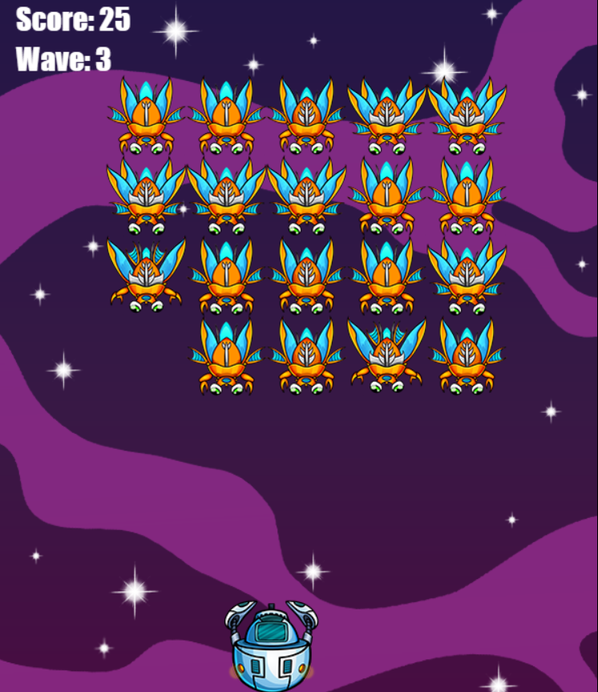

 Tell me how to remove them locally and remotely.

git push origin :branch_name

git branch -d branch_name

Tell me how to checkout another branch without commit 
changes

git stash
git stash pop

● Tell me how to list tags.
  git tag 

To delete remote tag

git push origin --delete v1.0

● To delete local tags
git tag -d v1.0

